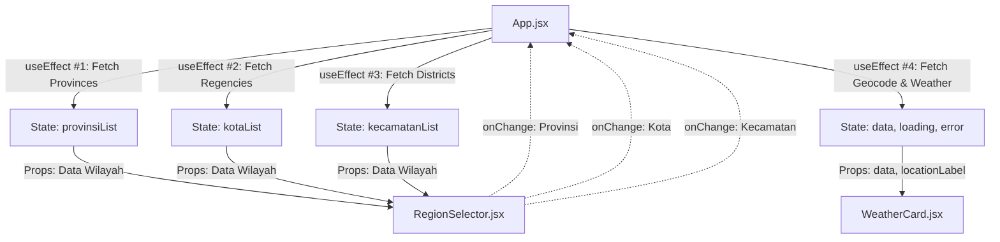
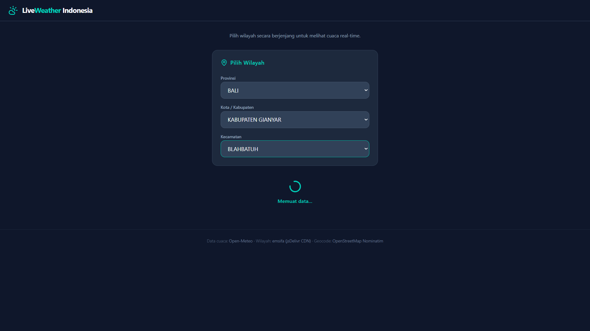
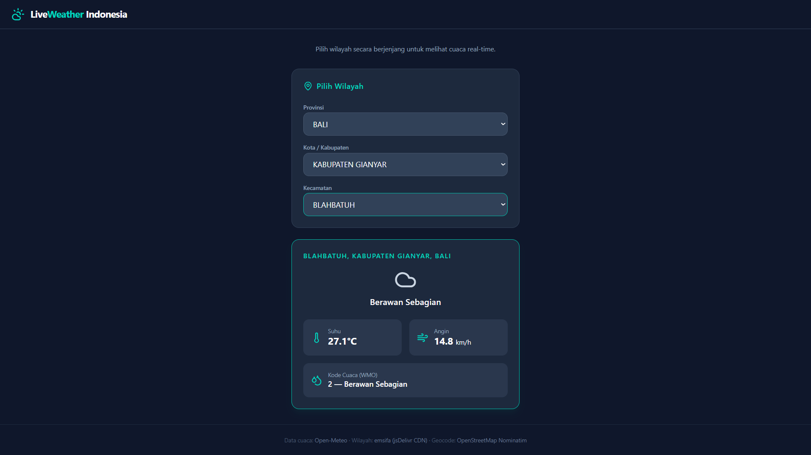
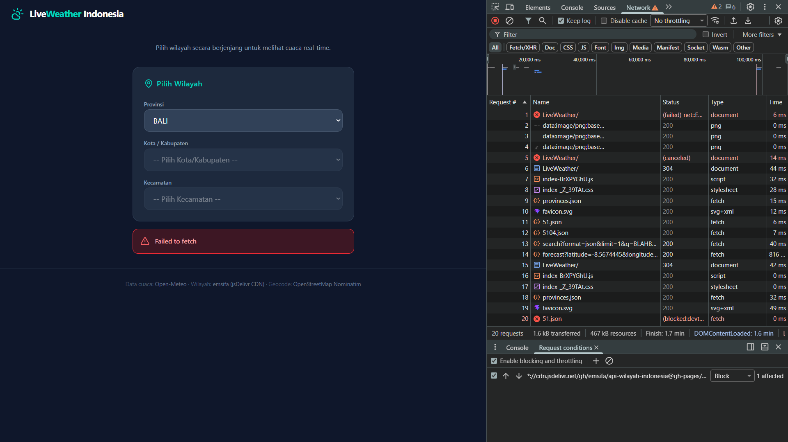

Aplikasi web interaktif berbasis React untuk melihat data cuaca real-time di seluruh wilayah Indonesia.
Link: [LiveWeather](https://okaajelantik.github.io/LiveWeather/)

---

# 1. Diagram Alur Fetching API



Aplikasi ini menggunakan 4 `useEffect` yang saling membutuhkan. Saat *state* pilihan wilayah (provinsi) berubah oleh interaksi di `RegionSelector`, perubahan *state* tersebut memicu `useEffect` berikutnya untuk mengambil data tingkat lanjut (Kota/Kabupaten), hingga akhirnya memperoleh koordinat (via Nominatim) dan memuat data cuaca (via Open-Meteo) untuk ditampilkan di `WeatherCard`. Indikator keberhasilan proses *fetch*  dikelola oleh *state* `loading` dan `error` di `App.jsx`.

---

# 2. Bedah Kode

## `async/await`
Dalam `App.jsx`, *fetching* data HTTP merupakan operasi asinkron karena memerlukan waktu tunggu respon. Agar tidak terjadi *blocking* pada UI, digunakan `async/await` sehingga eksekusi kode dapat menunggu data server diterima sebelum memprosesnya lebih lanjut.

```jsx
const fetchWeather = async () => {
  // ...
  const geoRes = await fetch(`https://nominatim.openstreetmap.org/search?format=json&limit=1&q=${q}`)
  const geoData = await geoRes.json()
  // ...
}
```

## `try...catch...finally` dan `setLoading(false)`
Setiap proses *fetching* memerlukan mekanisme  *error-handling* yang baik. `try` bertugas mengevaluasi blok yang menjalankan *fetching* data. Jika terjadi *error* akan ditangkap dan dikembalikan oleh `setError`. `setLoading` memastikan ada *feedback* ke *user*.

```jsx
setLoading(true)    // aktifkan indikator loading
setError(null)
setData(null)
try {               
  // fetching data...
} catch (err) {     
  setError(err.message) // catch error
} finally {         
  setLoading(false) // matikan indikator loading
}
```

## `!response.ok`
Fungsi `fetch()` bawaan browser hanya menganggap *request* gagal jika terjadi gangguan koneksi internet. Ia tidak mengembalikan *error* untuk respons HTTP berstatus lain. Untuk ini perlu dibuatkan status *error* yang representatif kepada *user*. 

```jsx
const weatherRes = await fetch(
  `https://api.open-meteo.com/v1/forecast?latitude=${lat}&longitude=${lon}&current_weather=true`
)
if (!weatherRes.ok) throw new Error(`Gagal memuat data cuaca (${weatherRes.status})`) 
const weatherData = await weatherRes.json()
```

---

## 3. Bukti Visual UI

### Tampilan Saat Loading (Spinner)


### Tampilan Saat Data Cuaca Berhasil Tampil


### Tampilan Saat Terjadi Error Jaringan


---

# Log Prompt AI

```instruction.md
TECH STACK: React (Vite) + Tailwind CSS (vite) + Lucide React

Platform Live Weather App Indonesia interaktif berbasis pemilihan wilayah berjenjang (Provinsi -> Kota/Kabupaten -> Kecamatan) untuk menampilkan data cuaca real-time.

HARD CONSTRAINTS:
1. Tiga State Wajib Fetching: Kelola state `data` (cuaca), `loading` ( boolean indikator), dan `error` (pesan kegagalan) di Parent (`App.jsx`).
2. Reactive Fetch & useEffect Berjenjang:
   - `useEffect(..., [])`: Fetch daftar Provinsi dari `https://cdn.jsdelivr.net/gh/emsifa/api-wilayah-indonesia@gh-pages/api/provinces.json` sekali saat mount.
   - `useEffect(..., [selectedProvinsi])`: Fetch daftar Kota berdasarkan ID provinsi dari `https://cdn.jsdelivr.net/gh/emsifa/api-wilayah-indonesia@gh-pages/api/regencies/{idProvinsi}.json`.
   - `useEffect(..., [selectedKota])`: Fetch daftar Kecamatan berdasarkan ID kota dari `https://cdn.jsdelivr.net/gh/emsifa/api-wilayah-indonesia@gh-pages/api/districts/{idKota}.json`.
   - `useEffect(..., [selectedKecamatan])`: 
     a. Fetch koordinat Lat/Long dari OpenStreetMap Nominatim (`https://nominatim.openstreetmap.org/search?format=json&q={namaKecamatan},{namaKota}`).
     b. Setelah dapat koordinat, fetch cuaca dari Open-Meteo (`https://api.open-meteo.com/v1/forecast?latitude={lat}&longitude={lon}&current_weather=true`).
3. Handling HTTP Errors: Gunakan blok `try...catch...finally`. Didalam `try`, periksa `if (!res.ok)` secara manual dan throw Error jika gagal. Pastikan `setLoading(false)` dipanggil di dalam blok `finally`.
4. Modular Components (Simpan di `src/components/`):
   - `App.jsx`: Parent component tempat penyimpanan state utama dan logika fetch API.
   - `RegionSelector.jsx`: Menampilkan 3 elemen `<select>` (Provinsi, Kota, Kecamatan) sebagai Controlled Component.
   - `WeatherCard.jsx`: Menampilkan UI suhu, kecepatan angin, dan kode cuaca jika data berhasil di-fetch.
   - `LoadingUI.jsx`: UI indikator saat data cuaca/wilayah sedang dimuat.
   - `ErrorMsg.jsx`: Component alert jika terjadi error jaringan atau data tidak ditemukan.
5. Code Annotation: Berikan komentar inline singkat pada baris kode kunci dengan tag.

STYLING & VIBE:
- Tema "Dark Weather Dashboard": Gunakan background `bg-slate-900`, teks `text-white`, card `bg-slate-800` dengan border `border-teal-500`, dan aksen warna `text-teal-400`.
- Tambahkan icon pendukung menggunakan `lucide-react` (seperti Wind, Termometer, MapPin, Search).
```

## Saat Penggantian API
Error terdokumentasi di file `AGENT/localhost-1788334122108.log`
> Dari log pada @[AGENT/localhost-1788334122108.log] cari alternatif API dan lakukan pengujian. Ganti API yang gagal dengan yang baru.
